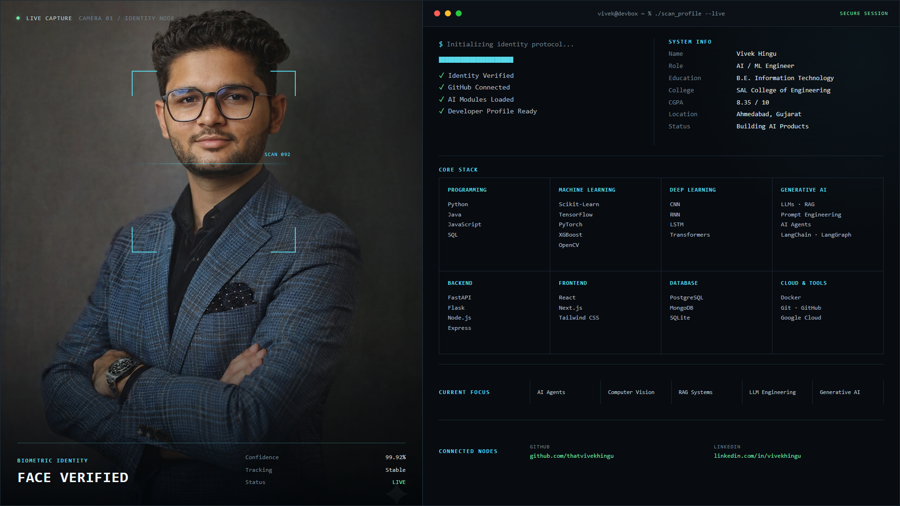

 

## About me

I'm **Vivek Hingu**, an Information Technology engineering student from Gujarat, India, focused on artificial intelligence and machine learning. I enjoy taking projects through the full lifecycle: understanding data, training models, building APIs, and creating interfaces people can actually use.

- Currently building full-stack AI and business intelligence applications
- Learning machine learning, data science, deep learning, and generative AI
- Interested in intelligent products that solve practical, real-world problems
- Open to collaborating on AI/ML, data, and open-source projects
- Reach me at **[hinguvivek05@gmail.com](mailto:hinguvivek05@gmail.com)**

## Tech stack

### AI, ML & Data

### Development & Tools

## Featured projects

| Project | What it does | Core stack |
| --- | --- | --- |
| [AI Startup Success Predictor](https://github.com/thatvivekhingu/Ai_Startup_Success_Predictor) | Predicts startup outcomes and presents business intelligence through a full-stack analytics dashboard. | Machine Learning, FastAPI, React |
| [Bharat Bhasha AI](https://github.com/thatvivekhingu/Bharat_Bhasha_Ai) | Builds AI-powered experiences around Indian languages and accessible communication. | AI, JavaScript, HTML |
| [Recipe Recommender System](https://github.com/thatvivekhingu/Recipe-Recommender-system-) | Recommends relevant recipes through a practical web interface. | Recommendation Systems, Python, HTML |
| [Machine Learning](https://github.com/thatvivekhingu/Machine_learning) | Documents hands-on ML experiments, notebooks, and model-building practice. | Python, Jupyter, scikit-learn |

## GitHub dashboard

## Connect

Learning in public, one useful project at a time.

